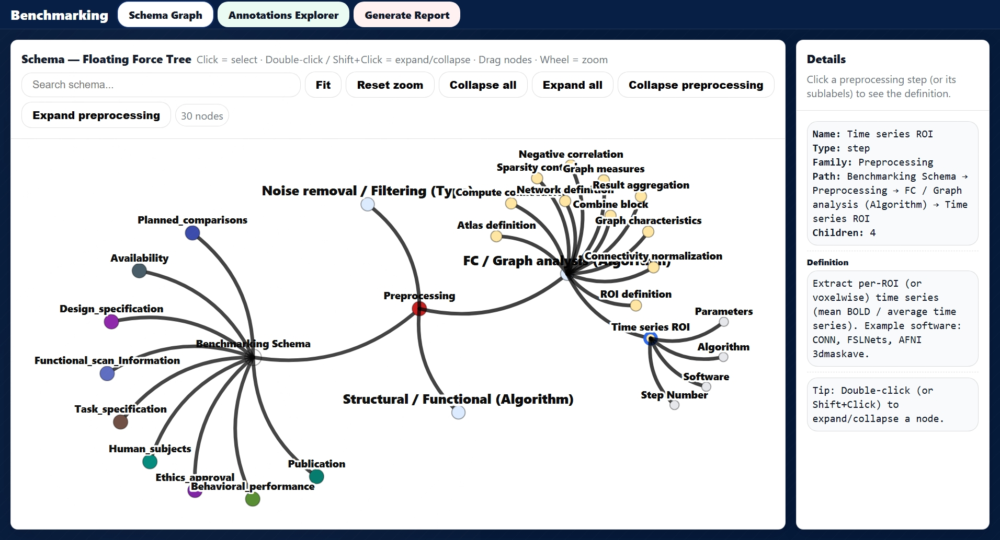
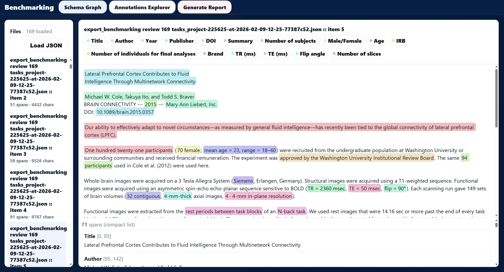
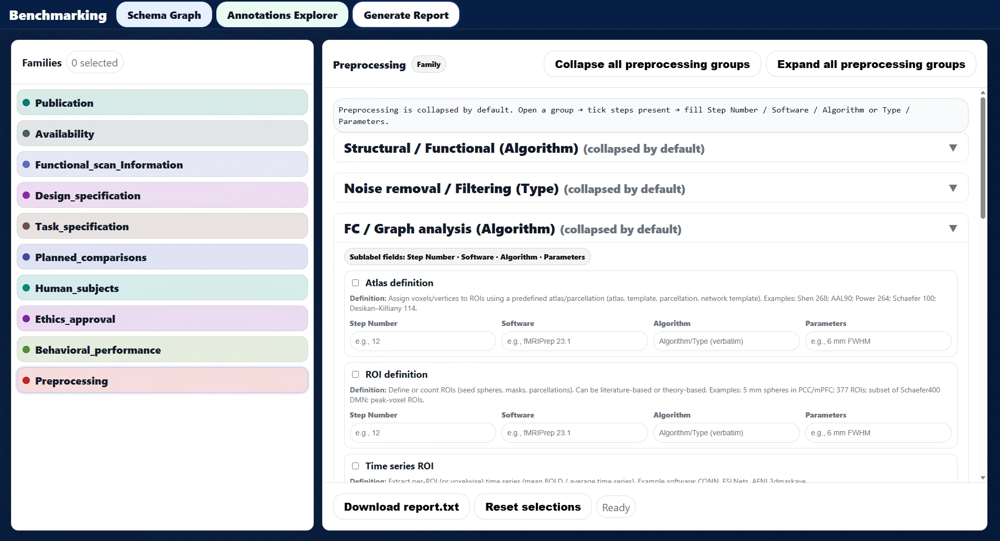

# 📊 Benchmarked Annotation Dataset for LLM-Based Information Extraction

## 🔒 Repository Access
This is a **private repository** containing a **benchmarked and curated dataset** used for evaluating and comparing multiple LLM prompting strategies for structured information extraction from scientific literature.

The repository is intended for **internal use and controlled collaboration only**.

---

## 📌 Overview

This repository contains:

- **Documented prompt specifications** (baseline, GA-focused, and final refined prompts)
- A **fully annotated benchmark dataset** (170 files)
- Outputs from **multiple LLM prompting strategies**
- **Comparison, merging, and validation scripts**
- Interactive **HTML-based visualization tools** for schema exploration and annotation inspection
- A visual **workflow of the benchmarking pipeline**

The dataset enables:
- Systematic comparison of *initial*, *refined*, and *GA-based* prompts
- Quantitative mismatch analysis between LLM outputs and a reference database
- Reproducible benchmarking and error analysis

---

## 📂 Repository Structure

```
├── Annotated_Files/
│   └── all_annotations.json
│
├── Images/
│   └── benchmarking_workflow.html
│
├── JSON_Files/
│   ├── JSON_Firstprompt_files/
│   ├── JSON_Finalprompt_files/
│   ├── JSON_GAprompt_files/
│   └── JSON_Combined_files/
│
├── Prompts/
│   ├── First Prompt.docx
│   ├── GA Prompt.docx
│   └── Final Prompt.docx
│
├── Python_Scripts/
│   ├── combine_summary.py
│   ├── mismatch_checker.py
│   ├── merge_json_file.py
│   └── review_newversion.py
│
├── Schema_Viewer/
│   └── schema_viewer.html
│
└── README.md
```

---

## 1️⃣ Annotated Files (Combined)

**Path:**  
`Annotated_Files/all_annotations.json`

**Description:**  
- Contains **all 170 annotated JSON files merged into a single file**
- Each document retains its **full annotation structure**
- Designed for **direct import into any annotation viewer** (e.g., Label Studio or compatible tools)

**Usage:**  
- Download the file  
- Import into your annotation/inspection tool  
- Instantly browse all documents and their complete annotations  

---

## 2️⃣ Images (Benchmarking Workflow)

**Path:**  
`Images/benchmarking_workflow.html`

**Description:**  
- Visual overview of the **benchmarking and extraction pipeline**
- Illustrates prompt variants, JSON generation, merging logic, mismatch analysis, and review cycles

---

## 3️⃣ JSON Files (Prompt-wise Outputs)

**Path:**  
`JSON_Files/`

### Subfolders

- **JSON_Firstprompt_files/**  
  JSON files produced using the initial baseline prompt.

- **JSON_Finalprompt_files/**  
  JSON files generated using the final refined prompt.

- **JSON_GAprompt_files/**  
  JSON files produced using a Graph-Analysis (GA)–focused prompt.

- **JSON_Combined_files/**  
  JSON files created by merging outputs from the initial and GA-based prompts.

---

## 4️⃣ Prompts

**Path:**  
`Prompts/`

This folder contains the **exact prompt specifications** used to generate the LLM outputs included in this benchmarked dataset. Each prompt represents a distinct stage in the prompt development and evaluation pipeline.

The prompts are provided as **`.docx` files** to preserve structure, formatting, and explanatory notes.

### 📄 Prompt Files

#### 4.1 `First Prompt.docx`
- Initial **baseline prompt** used for large-scale information extraction  
- Captures a broad range of metadata with minimal optimization  
- Serves as the starting point for benchmarking LLM performance  

#### 4.2 `GA Prompt.docx`
- Specialized prompt focusing on **Graph Analysis (GA)**–related metadata  
- Targets graph-theoretical decisions, parameters, and analytical steps  
- Improves extraction accuracy for GA-specific fields  

#### 4.3 `Final Prompt.docx`
- Final refined and optimized prompt  
- Integrates insights from baseline errors, GA prompt strengths, and mismatch reviews  
- Produces the highest-quality and most consistent extraction outputs  

---

## 5️⃣ Python Scripts

**Path:**  
`Python_Scripts/`

### Script Descriptions

- **combine_summary.py**  
  Generates a global mismatch summary and outputs Excel/CSV files.

- **mismatch_checker.py**  
  Compares LLM-extracted JSON files with a reference Excel database.

- **merge_json_file.py**  
  Combines JSON outputs from initial and GA-based prompts.

- **review_newversion.py**  
  Supports review, validation, and correction of mismatches.

---
# 🧭 Schema_Viewer (Interactive Schema Explorer)

## Path
`schema_viewer/schema_viewer.html`


## Description

This folder contains an interactive, web-based schema exploration and report-generation tool developed to support understanding, validation, and manual inspection of the benchmarking schema used in this project.

The schema viewer is designed to bridge the gap between:

- **Abstract annotation schemas**, and  
- **Concrete extraction decisions** made by LLMs and human annotators.

It provides a visual and structured interface to explore **families, groups, steps, and sublabels** used in the benchmark.


## 🔹Key Functionalities

### Schema Graph (Tab 1)

- Interactive force-directed graph representation of the full benchmarking schema  
- Nodes represent families, groups, steps, and sublabels  
- Click to inspect definitions, relationships, and hierarchy  
- Supports expand/collapse, zooming, and search  
<p align="center">
  
</p>

### Annotations Explorer (Tab 2)

- Load Label Studio–compatible JSON files  
- Visualize extracted text with highlighted annotation spans  
- Inspect label distributions and annotation metadata  
<p align="center">
  
</p>


### Generate Report (Tab 3)

- Manual, guided report builder aligned with the benchmarking schema  
- Allows users to:
  - Select schema families  
  - Tick present preprocessing steps  
  - Enter step numbers, software, algorithms/types, and parameters  
- Produces a structured, text-based report summarizing preprocessing and analysis decisions  
<p align="center">
  
</p>


## 🎯 Purpose in the Benchmarking Pipeline

The `schema_viewer` serves multiple roles:

- **Schema documentation**: makes the full analytical decision space explicit and navigable  
- **Annotation validation**: enables rapid inspection of extracted metadata  
- **Human-in-the-loop review**: supports correction and confirmation of LLM outputs  
- **Reporting aid**: standardizes how preprocessing pipelines are summarized  

This tool is especially useful for:

- Onboarding new collaborators  
- Reviewing edge cases and mismatches  
- Demonstrating the scope and complexity of the benchmarking schema  

## ▶️ Usage

- Open `schema_viewer.html` in any modern web browser (Chrome/Edge recommended)  
- No server or backend required — runs fully client-side  
- Optional: load JSON annotation files in the **Annotations Explorer** tab  

---

## 🔁 Benchmarking Workflow (Summary)

1. Run LLM extraction with different prompts  
2. Store prompt-specific JSON outputs  
3. Merge selected outputs  
4. Compare against the reference database  
5. Generate mismatch summaries  
6. Review and correct inconsistencies  
7. Produce final benchmark-ready dataset  

---

## 📎 Notes

- All data is **benchmarked against a curated reference**
- Intended for **research and methodological evaluation**
- Redistribution is **not permitted** without explicit authorization

---

## License
See the LICENSE file in this repository.

---

## Contact
Sana Hassan Imam  
GitHub: sanahassanimam  
Email: sana.hassan.imam@uni-oldenburg.de
